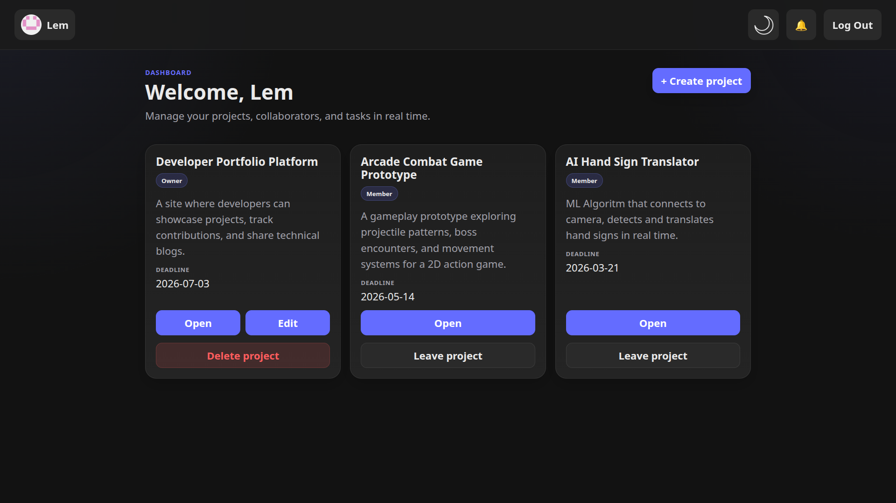
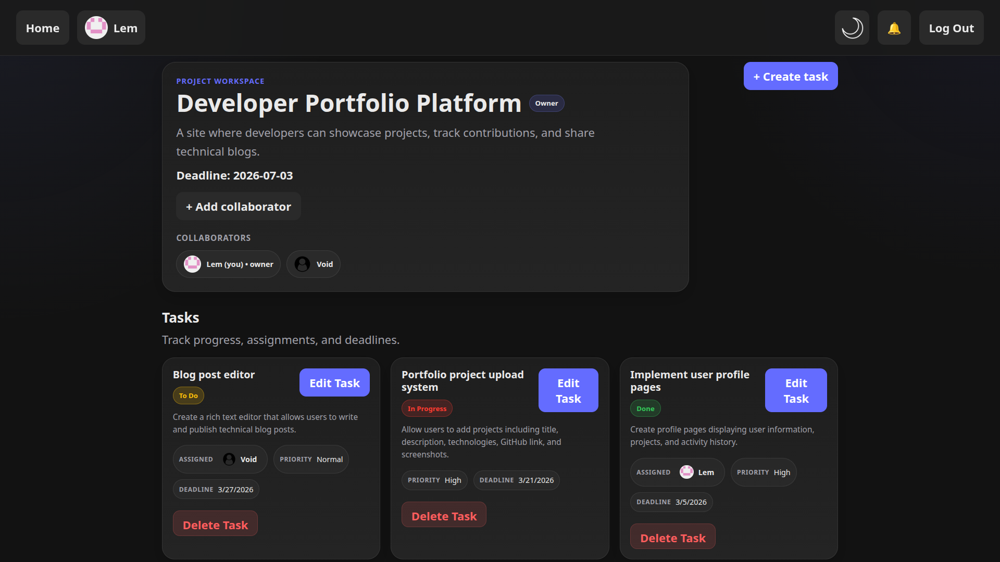
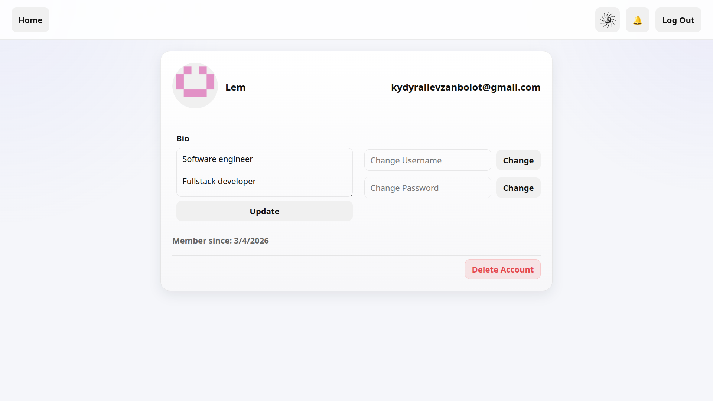
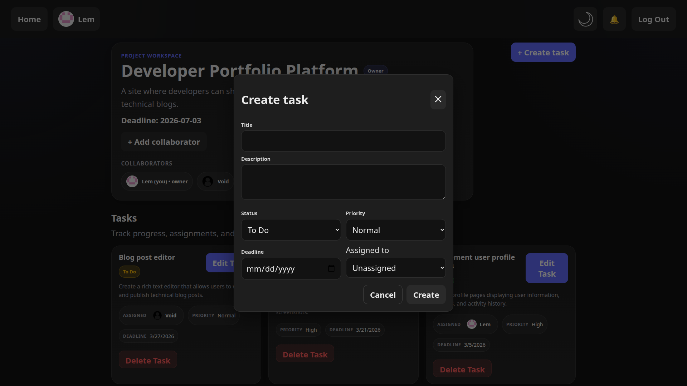
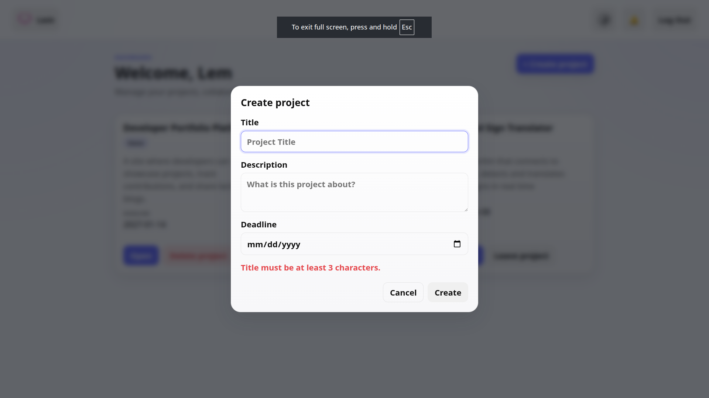

# Realtime Collaborative Task Manager

A real-time task tracking app for small teams, built with React, Zustand, and Firebase.

Live demo: https://realtime-collaborative-task-manager.vercel.app/







## Features

- Authentication with email/password and Google sign-in
- Email verification required for email/password accounts before login
- Private dashboard and protected project/profile routes for signed-in users
- Project creation, editing, deletion, and member leave flow
- Invite flow with pending invites, accept/decline actions, and header badge count
- Real-time project and invite updates with Firestore `onSnapshot` listeners
- Task creation, editing, owner-only deletion, assignee selection, priority, status, and deadline support
- Editable user profile with username, bio, password update, profile picture upload/removal, and account deletion
- Public profile pages for collaborators at `/profile/:uid`
- Persisted dark/light theme with Zustand

## Realtime Architecture

The app uses Firestore snapshot listeners instead of polling:

Firestore
-> `onSnapshot` listeners
-> React state updates
-> UI re-render

This is used for:

- project lists on the dashboard
- task lists inside a project
- pending invite updates and the invite badge

## Tech Stack

| Layer | Technology |
|---|---|
| Frontend | React 19 |
| State Management | Zustand |
| Backend | Firebase Authentication |
| Database | Cloud Firestore |
| File Storage | Firebase Storage |
| Routing | React Router v7 |
| Build Tool | Vite |
| Deployment | Vercel |

## Running Locally

This project depends on Firebase Authentication, Firestore, and Storage. To run it locally, create your own Firebase project and provide the app config through environment variables.

```bash
git clone https://github.com/Lemming-CS/realtime-collaborative-task-manager.git
cd realtime-collaborative-task-manager
npm install
```

Create a `.env` file in the project root:

```env
VITE_API_KEY=your_api_key
VITE_AUTH_DOMAIN=your_project.firebaseapp.com
VITE_PROJECT_ID=your_project_id
VITE_STORAGE_BUCKET=your_project.appspot.com
VITE_MESSAGING_SENDER_ID=your_sender_id
VITE_APP_ID=your_app_id
```

Recommended Firebase setup:

- Enable Email/Password authentication
- Enable Google authentication
- Enable Firestore Database
- Enable Firebase Storage
- Deploy the Firestore rules from [`firestore.rules`](firestore.rules)

Start the development server:

```bash
npm run dev
```

Open `http://localhost:5173` in your browser.

## Available Scripts

```bash
npm run dev
npm run build
npm run preview
npm run lint
```

## User Flows

### Authentication

- Users can register with email/password
- New email/password accounts receive a verification email
- Email/password login is blocked until the account is verified
- Users can also sign in with Google

### Projects and Tasks

- A signed-in user can create a project and becomes its owner
- Owners can edit and delete their projects
- Non-owners can leave projects they are part of
- Owners can invite collaborators by username
- Project members can create and edit tasks
- Only the project owner can delete tasks

### Profiles

- Users can update their username and bio
- Users can upload or remove a profile picture using Firebase Storage
- Users can change their password
- Users can delete their account
- Collaborator avatars link to public profile pages

## Project Structure

```text
.
├── docs/
├── src/
│   ├── assets/
│   ├── components/
│   ├── firebase/
│   ├── hooks/
│   ├── pages/
│   ├── store/
│   ├── App.jsx
│   └── main.jsx
├── firestore.rules
├── package.json
├── vercel.json
├── vite.config.js
└── README.md
```

## Security

The app uses Firestore rules for access control. The exact rules live in [`firestore.rules`](firestore.rules).

High-level policy:

- `users`: public read, self-write only
- `projects`: members can read, authenticated users can create their own projects, only owners can delete, and invited users can join by adding themselves through a valid pending invite
- `tasks`: project members can read, create, and update tasks; only project owners can delete tasks
- `invites`: invitee and inviter can read invites, project owners can create invites, invitees can update invite status, and invitees or project owners can delete invites

## Deployment Notes

- The app is deployed on Vercel
- [`vercel.json`](vercel.json) includes a rewrite so React Router routes resolve correctly on refresh

## License

MIT
